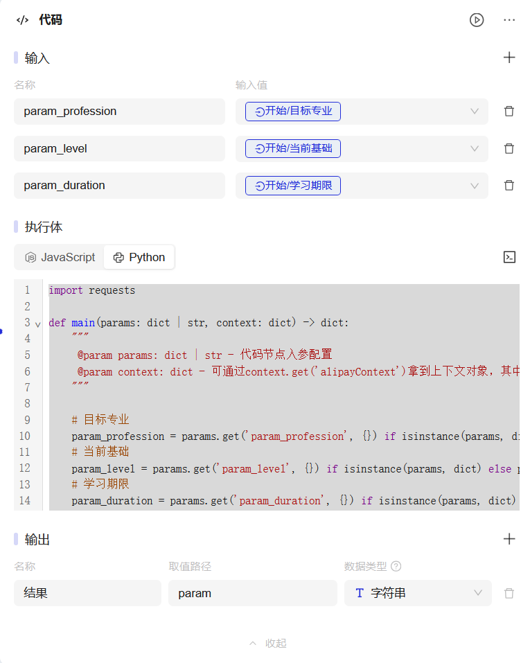
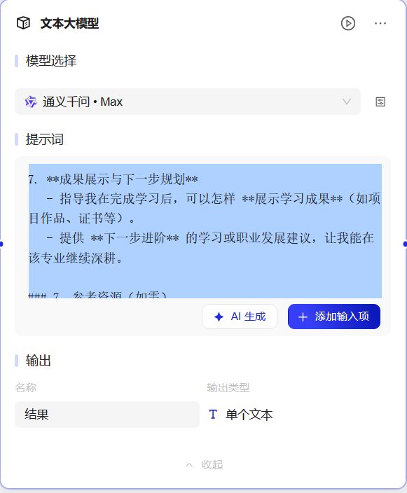

# AI AGENT Datawhale
## 1.AI Agent - Datawhale
### 1.1 Content

Master the practical skills of AI Agent/ agent
- Understand the principles and trends of AI Agent technology
- Learn the basic use of Alipay treasure box
- Practice advanced: Agent function design, Prompt engineering, workflow and iterative thinking

 Make your own work and participate in the learning competition
- Learn to apply, complete their own creation
- Review summary, let the works and ideas go further

### 1.2 Result
The final learning results of the entire study period, combined with their own passion and interest, develop and complete the work, submit your work, submit the work should include:

Application scheme (required) : project background, application value, technical scheme, project effect, team introduction, etc. PDF or PPT format, no more than 50MB.

Application Works (Required) : Application experience entry and experience method

Talk is cheap, Show me the demo, works focus on completion rather than perfection

## 2.Grading rules

### 2.1 New and unique

- Whether the idea of the innovative work

### 2.2 Application value

- Whether the Agent can effectively solve practical problems 

- whether it has high commercial potential/social value

### 2.3 Technical implementation 

- Based on Alipay treasure box design Agent implementation scheme 
- Evaluation of its technical difficulty and complexity

### 2.4 User experience 

- Whether the user interface is intuitive and easy to use
- whether the interaction logic is clear and reasonable, and the user experience is comfortable

## 3.Learning

### 3.1 How I Won Singapore’s GPT-4 Prompt Engineering Competition [1]

### 3.1.1. Structuring prompts using the CO-STAR framework
Effective prompt structuring is crucial for eliciting optimal responses from an LLM. 

The CO-STAR framework, a brainchild of GovTech Singapore’s Data Science & AI team, is a handy template for structuring prompts. 

It considers all the key aspects that influence the effectiveness and relevance of an LLM’s response, leading to more optimal responses.
(C) Context: Provide background information on the task

This helps the LLM understand the specific scenario being discussed, ensuring its response is relevant.

(O) Objective: Define what the task is that you want the LLM to perform

Being clear about your objective helps the LLM to focus its response on meeting that specific goal.

(S) Style: Specify the writing style you want the LLM to use

This could be a particular famous person’s style of writing, or a particular expert in a profession, like a business analyst expert or CEO. This guides the LLM to respond with the manner and choice of words aligned with your needs.

(T) Tone: Set the attitude of the response

This ensures the LLM’s response resonates with the intended sentiment or emotional context required. Examples are formal, humorous, empathetic, among others.

(A) Audience: Identify who the response is intended for

Tailoring the LLM’s response to an audience, such as experts in a field, beginners, children, and so on, ensures that it is appropriate and understandable in your required context.

(R) Response: Provide the response format

This ensures that the LLM outputs in the exact format that you require for downstream tasks. Examples include a list, a JSON, a professional report, and so on. For most LLM applications which work on the LLM responses programmatically for downstream manipulations, a JSON output format would be ideal.

```python
    # CONTEXT #
    I want to advertise my company’s new product. My company’s name is Alpha and the product is called Beta, which is a new ultra-fast hairdryer.

    # OBJECTIVE #
    Create a Facebook post for me, which aims to get people to click on the product link to purchase it.

    # STYLE #
    Follow the writing style of successful companies that advertise similar products, such as Dyson.

    # TONE #
    Persuasive

    # AUDIENCE #
    My company’s audience profile on Facebook is typically the older generation. Tailor your post to target what this audience typically looks out for in hair products.

    # RESPONSE #
    The Facebook post, kept concise yet impactful.
```

### 3.1.2.Sectioning prompts using delimiters
Example 1 : <<< >>>, ###, ===
```python
    Classify the sentiment of each conversation in <<<CONVERSATIONS>>> as
    ‘Positive’ or ‘Negative’. Give the sentiment classifications without any other preamble text.

    ###

    EXAMPLE CONVERSATIONS

    [Agent]: Good morning, how can I assist you today?
    [Customer]: This product is terrible, nothing like what was advertised!
    [Customer]: I’m extremely disappointed and expect a full refund.

    [Agent]: Good morning, how can I help you today?
    [Customer]: Hi, I just wanted to say that I’m really impressed with your
    product. It exceeded my expectations!

    ###

    EXAMPLE OUTPUTS

    Negative

    Positive

    ###

    <<<
        [Agent]: Hello! Welcome to our support. How can I help you today?
    [Customer]: Hi there! I just wanted to let you know I received my order, and
    it’s fantastic!
    [Agent]: That’s great to hear! We’re thrilled you’re happy with your purchase.
    Is there anything else I can assist you with?
    [Customer]: No, that’s it. Just wanted to give some positive feedback. Thanks
    for your excellent service!

    [Agent]: Hello, thank you for reaching out. How can I assist you today?
    [Customer]: I’m very disappointed with my recent purchase. It’s not what I expected at all.
    [Agent]: I’m sorry to hear that. Could you please provide more details so I can help?
    [Customer]: The product is of poor quality and it arrived late. I’m really
    unhappy with this experience.
    >>>
```

Example2：XML Tags

```python
    Classify the sentiment of the following conversations into one of two classes, using the examples given. Give the sentiment classifications without any other
    preamble text.

    <classes>
    Positive
    Negative
    </classes>

    <example-conversations>
    [Agent]: Good morning, how can I assist you today?
    [Customer]: This product is terrible, nothing like what was advertised!
    [Customer]: I’m extremely disappointed and expect a full refund.

    [Agent]: Good morning, how can I help you today?
    [Customer]: Hi, I just wanted to say that I’m really impressed with your
    product. It exceeded my expectations!
    </example-conversations>

    <example-classes>
    Negative

    Positive
    </example-classes>

    <conversations>
    [Agent]: Hello! Welcome to our support. How can I help you today?
    [Customer]: Hi there! I just wanted to let you know I received my order, and
    it’s fantastic!
    [Agent]: That’s great to hear! We’re thrilled you’re happy with your purchase.
    Is there anything else I can assist you with?
    [Customer]: No, that’s it. Just wanted to give some positive feedback. Thanks
    for your excellent service!

    [Agent]: Hello, thank you for reaching out. How can I assist you today?
    [Customer]: I’m very disappointed with my recent purchase. It’s not what I
    expected at all.
    [Agent]: I’m sorry to hear that. Could you please provide more details so I
    can help?
    [Customer]: The product is of poor quality and it arrived late. I’m really
    unhappy with this experience.
    </conversations>
```

### 3.1.3. Creating system prompts with LLM guardrails

Use System Prompts to provide instructions that you want the LLM to remember when responding throughout the entire chat.

Example

```python
You will answer questions using this text: [insert text].
You will respond with a JSON object in this format: {“Question”: “Answer”}.
If the text does not contain sufficient information to answer the question, do not make up information and give the answer as “NA”.
You are only allowed to answer questions related to [insert scope]. Never answer any questions related to demographic information such as age, gender, and religion.
```

### 3.1.4.Analyzing datasets using only LLMs, without plugins or code

Types of dataset analysis that LLMs are *not* great at
- Descriptive Statistics: Summarizing numerical columns quantitatively, through measures like the mean or variance.
- Correlation Analysis: Obtaining the precise correlation coefficient between columns.
- Statistical Analysis: Such as hypothesis testing to determine if there are statistically significant differences between groups of data points.
- Machine Learning: Performing predictive modelling on a dataset such as using linear regressions, gradient boosted trees, or neural networks.

Types of dataset analysis that LLMs are great at

- Anomaly detection: Identifying unusual data points that deviate from the norm, based on one or more column values.
- Clustering: Grouping data points with similar characteristics across columns.
- Cross-Column Relationships: Identifying combined trends across columns.
- Textual Analysis (For text-based columns): Categorization based on topic or sentiment.
- Trend Analysis (For datasets with time aspects): Identifying patterns, seasonal variations, or trends within columns across time.

Example
1. Breaking down a complex task into simple steps
2. Referencing intermediate outputs from each step
3. Formatting the LLM’s response
4. Separating the instructions from the dataset

1.LLMs are great at performing simple tasks, but not so great at complex ones. As such, with complex tasks like this one, it is important to break down the task into simple step-by-step instructions for the LLM to follow. The idea is to give the LLM the steps that you yourself would take to execute the task.

2.When providing the step-by-step process to the LLM, we give the intermediate output from each step a capitalized VARIABLE_NAME, namely CLUSTERS, CLUSTER_INFORMATION, CLUSTER_NAME, MARKETING_IDEAS and RATIONALE.
Capitalization is used to differentiate these variable names from the body of instructions given. These intermediate outputs can later be referenced using square brackets as [VARIABLE_NAME].

3.Here, we ask for a markdown report format, which beautifies the LLM’s response. Having variable names from intermediate outputs again comes in handy here to dictate the structure of the report.

4.You’ll notice that we never gave the dataset to the LLM in our first prompt. Instead, the prompt gives only the task instructions for the dataset analysis, with this added to the bottom:

    # START ANALYSIS #
    If you understand, ask me for my dataset.

```python
    System Prompt:
    I want you to act as a data scientist to analyze datasets. Do not make up information that is not in the dataset. For each analysis I ask for, provide me with the exact and definitive answer and do not provide me with code or instructions to do the analysis on other platforms.

    Prompt:
    # CONTEXT #
    I sell wine. I have a dataset of information on my customers: [year of birth, marital status, income, number of children, days since last purchase, amount spent].
    #############


    # OBJECTIVE #
    I want you use the dataset to cluster my customers into groups and then give me ideas on how to target my marketing efforts towards each group. Use this step-by-step process and do not use code:


    1. CLUSTERS: Use the columns of the dataset to cluster the rows of the dataset, such that customers within the same cluster have similar column values while customers in different clusters have distinctly different column values. Ensure that each row only belongs to 1 cluster.

    For each cluster found,
    2. CLUSTER_INFORMATION: Describe the cluster in terms of the dataset columns.
    3. CLUSTER_NAME: Interpret [CLUSTER_INFORMATION] to obtain a short name for the customer group in this cluster.

    4. MARKETING_IDEAS: Generate ideas to market my product to this customer group.
    5. RATIONALE: Explain why [MARKETING_IDEAS] is relevant and effective for this customer group.
    #############


    # STYLE #
    Business analytics report
    #############
    # TONE #
    Professional, technical
    #############

    # AUDIENCE #
    My business partners. Convince them that your marketing strategy is well thought-out and fully backed by data.
    #############

    # RESPONSE: MARKDOWN REPORT #
    <For each cluster in [CLUSTERS]>
    — Customer Group: [CLUSTER_NAME]
    — Profile: [CLUSTER_INFORMATION]
    — Marketing Ideas: [MARKETING_IDEAS]
    — Rationale: [RATIONALE]


    <Annex>
    Give a table of the list of row numbers belonging to each cluster, in order to back up your analysis. Use these table headers: [[CLUSTER_NAME], List of Rows].
    #############


    # START ANALYSIS #
    If you understand, ask me for my dataset.
```


## 4.学习规划大师
为用户提供专业知识的学习路径安排。

### 4.1 开始


### 4.2 拼接字符串



```python
import requests

def main(params: dict | str, context: dict) -> dict:
    """
     @param params: dict | str - 代码节点入参配置
     @param context: dict - 可通过context.get('alipayContext')拿到上下文对象，其中包含 requestId、traceId 等信息
    """

    # 目标专业
    param_profession = params.get('param_profession', {}) if isinstance(params, dict) else params
    # 当前基础
    param_level = params.get('param_level', {}) if isinstance(params, dict) else params
    # 学习期限
    param_duration = params.get('param_duration', {}) if isinstance(params, dict) else params
    
    # 拼接输出内容
    param = f"我想快速学习{param_profession}，目前基础是{param_level}，并且希望在{param_duration}内取得显著进步！"
    
    return param

```


### 4.3 夸克搜索节点

### 4.4 自建数据库


### 4.5文本大模型




```python
## :快速学习 {{input_hgtoen-text_vxy1nm-目标专业}} 的学习路径规划

### 1. Context（背景）
你是一位资深的“学习规划大师”。我目前的需求是，想要在有限的时间内快速掌握 **{{input_hgtoen-text_vxy1nm-目标专业}}**。我的当前基础是 **{{input_hgtoen-option_5xxzjy-当前基础}}**，而可投入的学习期限为 **{{input_hgtoen-text_pb3wdy-学习期限}}**。请根据以上信息，为我制定一个详细且高效的学习路径。

### 2. Objective（目标）
- 根据我提供的目标专业、当前基础与学习期限，制定一条高效的学习路径。  
- 确保在规定时间内，我能系统掌握 **{{input_hgtoen-text_vxy1nm-目标专业}}** 的核心知识与技能。  
- 学习路径需包含**核心课程**、**关键资源**、**每日/每周学习任务**以及**定期评估与实践练习**等安排。

### 3. Style（风格）
- 学习路径呈现方式要 **清晰、条理分明**，便于我快速浏览与实施。  
- 需要给出 **阶段性** 和 **系统性** 的学习框架。

### 4. Tone（语气）
- 语气需要保持 **激励性** 和 **专业性**。  
- 务必为我提供 **切实可行** 的学习建议与资源，并 **鼓舞我保持学习动力**。

### 5. Audience（受众）
- 无论我是学生、职场人士还是想要转行，都能使用本学习路径快速入门并进阶。

### 6. Response（回应要求）
请根据以下结构，输出一份针对 **{{input_hgtoen-text_vxy1nm-目标专业}}** 的完整学习路径规划：

1. **专业概述**  
   - 简要介绍目标专业的主要内容、核心知识领域与应用场景。

2. **学习目标与计划概述**  
   - 结合**{{input_hgtoen-text_pb3wdy-学习期限}}**，为我制定明确的学习目标。  
   - 概要描述整体的学习计划框架。

3. **核心课程与学习资源**  
   - 针对专业必需的关键技能与知识点，推荐 **必学课程**、**书籍/文章**、**在线资源/平台** 或 **工具**。  
   - 给出每个资源的 **简要说明** 和 **使用建议**。

4. **每日/每周学习任务**  
   - 细分每个阶段（例如每日/每周）的具体学习任务。  
   - 包含**理论学习**、**实践操作**、**复习与巩固**等环节。

5. **项目实践与评估**  
   - 为我设计合适的 **项目实践**，使我能实际运用学到的知识。  
   - 提供 **定期测验** 或 **反馈建议** 方案，帮助评估学习成效并及时改进。

6. **学习提示**  
   - 包括 **时间管理**、**高效学习方法**、**资源整合** 与 **技术应用** 等方面的具体建议。  
   - 帮助我克服学习中常见的困难或瓶颈。

7. **成果展示与下一步规划**  
   - 指导我在完成学习后，可以怎样 **展示学习成果**（如项目作品、证书等）。  
   - 提供 **下一步进阶** 的学习或职业发展建议，让我能在该专业继续深耕。

### 7. 参考资源（如需）
- 若需要更多参考，请结合 **互联网或其他权威来源**（如在线学习平台、学术出版物）整理信息。
- 也可引用「{{plugin_1gjgb3-plugin_1gjgb3.output_0-结果}}」或{{dataset_nyorjx-dataset_nyorjx.output-结果}}中给出的资源或任何你认为合适的资源。

```

### 4.6 风格化Prompt


```python
### 你需要根据 {{input_hgtoen-text_vxy1nm-目标专业}}、{{input_hgtoen-option_5xxzjy-当前基础}} 和 {{input_hgtoen-text_pb3wdy-学习期限}}，为用户定制一份高效且可执行的学习计划。
请将最终计划以鼓舞人心、专业详细的风格输出，帮助用户在规定时间内快速掌握核心知识与技能。

### 请整理下面内容并输出计划
{{text_completion_k75zzd-text_completion_k75zzd.output-结果}}
```

### 4.7 测试效果


### 4.8应用发布与体验


```python
### 高效 Python 学习计划：一个月内从零到精通

#### 1. 专业概述
Python 是一种高级编程语言，以其简洁易读的语法和强大的功能而闻名。它广泛应用于 Web 开发、数据分析、人工智能、自动化脚本编写等领域。学习 Python 可以为你打开许多职业机会的大门，无论是作为初学者还是经验丰富的开发者。

#### 2. 学习目标与计划概述
- **学习目标**：在一个月内掌握 Python 的核心知识与技能，能够独立编写简单的程序，并具备进一步深入学习的基础。
- **计划框架**：
  - **第一周**：掌握 Python 基础语法和数据类型。
  - **第二周**：学习控制流、函数和模块。
  - **第三周**：理解面向对象编程和文件操作。
  - **第四周**：进行项目实践，巩固所学知识。

#### 3. 核心课程与学习资源
- **必学课程**：
  - **《Python 入门教程》**（慕课网）：适合初学者，内容全面，讲解清晰。
  - **《Python 编程：从入门到实践》**（Eric Matthes）：一本经典的 Python 教程，适合系统学习。
- **书籍/文章**：
  - **《Python Crash Course》**（Eric Matthes）：适合快速入门，内容丰富。
  - **《Automate the Boring Stuff with Python》**（Al Sweigart）：通过实际项目学习 Python。
- **在线资源/平台**：
  - **Codecademy**：提供互动式 Python 课程，适合动手实践。
  - **LeetCode**：提供大量的编程练习题，适合提高编程能力。
  - **GitHub**：可以找到许多开源项目，适合学习和实践。
- **工具**：
  - **PyCharm**：专业的 Python IDE，适合编写复杂的项目。
  - **Jupyter Notebook**：适合进行数据分析和可视化。

#### 4. 每日/每周学习任务
- **第一周**：掌握 Python 基础语法和数据类型
  - **周一**：安装 Python 和 PyCharm，学习变量、数据类型和基本输入输出。
  - **周二**：学习条件语句和循环语句。
  - **周三**：学习列表和字典。
  - **周四**：
```

### 4.9 发布链接

“学习规划大师”体验链接
https://tbox.alipay.com/pro/share/202412APb5Fl00191940?platform=WebService

相关资料GITHUB：
https://github.com/freshman2233/AI-AGENT-Datawhale


## Refer
[1] Teo, S. (n.d.). *How I won Singapore’s GPT-4 prompt engineering competition*. Towards Data Science. Retrieved December 29, 2023, from https://towardsdatascience.com/how-i-won-singapores-gpt-4-prompt-engineering-competition-34c195a93d41
